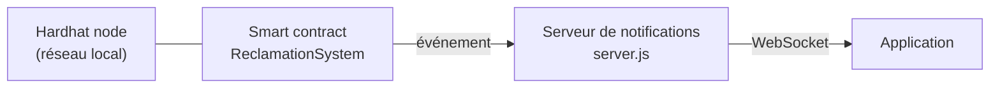

# 🔗 Lumina — Réclamations ENEO sur la blockchain

Module blockchain de LUMINA. Il enregistre les réclamations de surfacturation de façon **immuable** sur la blockchain et **notifie les utilisateurs en temps réel**.

[← Retour au README principal](../README.md)

---

## Sommaire

- [Aperçu](#aperçu)
- [Prérequis](#prérequis)
- [Installation](#installation)
- [Lancer la démonstration](#lancer-la-démonstration)
- [Test de validation](#test-de-validation)
- [Intégration frontend](#intégration-frontend)
- [Dépannage](#dépannage)

---

## Aperçu



| Composant | Rôle |
|-----------|------|
| `Reclamation.sol` | Smart contract : enregistrement des réclamations |
| `scripts/deploy.js` | Déploiement du contrat sur le réseau choisi |
| `scripts/test-direct.cjs` | Simulation d'une plainte pour valider la chaîne complète |
| `server.js` | Écoute les événements du contrat et envoie les alertes |

---

## Prérequis

- Node.js v18+
- npm

---

## Installation

À faire **une seule fois** :

```bash
# Dépendances (blockchain + serveur)
npm install

# Compilation du smart contract (génère l'ABI pour le frontend)
npx hardhat compile
```

---

## Lancer la démonstration

Ouvrez **3 terminaux** et suivez cet ordre.

### Terminal 1 — Réseau blockchain

```bash
npx hardhat node
```

Laissez ce terminal ouvert : il simule le registre public.

### Terminal 2 — Déploiement du contrat

```bash
npx hardhat run scripts/deploy.js --network localhost
```

> **Action requise :** copiez l'adresse du contrat affichée et vérifiez qu'elle est identique dans `server.js` et `scripts/test-direct.cjs`.

### Terminal 3 — Serveur de notifications

```bash
node server.js
```

Ce serveur fait le lien entre la blockchain et l'application.

---

## Test de validation

Depuis le **Terminal 2**, simulez une plainte :

```bash
npx hardhat run scripts/test-direct.cjs --network localhost
```

**Résultat attendu :**

| Terminal | Message |
|----------|---------|
| 2 | `✅ Succès ! Réclamation enregistrée.` |
| 3 | `🔔 Alerte : Nouvelle réclamation détectée !` |

---

## Intégration frontend

| Élément | Valeur |
|---------|--------|
| Adresse du contrat (déploiement local par défaut) | `0x5FbDB2315678afecb367f032d93F642f64180aa3` |
| ABI | `./artifacts/contracts/Reclamation.sol/ReclamationSystem.json` |
| URL WebSocket | `http://localhost:3000` |

> L'adresse ci-dessus est celle d'un premier déploiement sur un nœud Hardhat vierge. Elle change si le nœud a déjà reçu des transactions : utilisez toujours l'adresse affichée par votre déploiement.

---

## Dépannage

| Problème | Solution |
|----------|----------|
| Terminal figé | `Ctrl + C`, puis relancer la commande |
| Erreurs de compilation ou artefacts obsolètes | `npx hardhat clean` puis `npx hardhat compile` |
| Erreur de modules ES (`require` / `import`) | `npm pkg set type="module"` |
| Adresse du contrat invalide après redémarrage du nœud | Redéployer le contrat et mettre à jour `server.js` et `test-direct.cjs` |