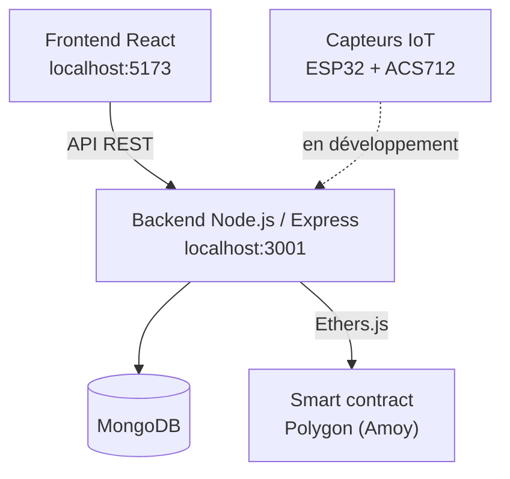

et<div align="center">

# ⚡ LUMINA

### Surveillance électrique & transparence énergétique

Aidez les abonnés ENEO du Cameroun à contester les surfacturations et à détecter le vol d'électricité, grâce à une preuve infalsifiable sur la blockchain Polygon.

[](LICENSE)
[](https://reactjs.org/)
[](https://nodejs.org/)
[](https://www.mongodb.com/)
[](https://soliditylang.org/)
[](https://polygon.technology/)

</div>

---

## Sommaire

- [À propos](#à-propos)
- [Problématique](#problématique)
- [Solution](#solution)
- [Architecture](#architecture)
- [Stack technique](#stack-technique)
- [Prise en main rapide](#prise-en-main-rapide)
- [Structure du projet](#structure-du-projet)
- [Fonctionnalités](#fonctionnalités)
- [Feuille de route](#feuille-de-route)
- [Documentation détaillée](#documentation-détaillée)
- [Contribuer](#contribuer)
- [Licence](#licence)
- [Contact](#contact)

---

## À propos

**LUMINA** (du latin *lumen*, « lumière ») est une application web de **surveillance électrique intelligente**. Elle apporte transparence et équité dans la relation entre les abonnés ENEO et leur fournisseur d'électricité.

| Pilier | Description |
|--------|-------------|
| 📊 Surveillance de la consommation | Calcul de la facture selon les tarifs officiels, détection d'anomalies |
| 🤖 Détection de fraude | Comparaison des courants entrant et sortant (capteurs IoT) |
| 🔗 Preuve blockchain | Enregistrement immuable et horodaté sur Polygon |
| 📱 Interface moderne | Responsive, pensée mobile-first, accessible à tous |

---

## Problématique

### 1. Surfacturations

| Indicateur | Valeur | Source |
|------------|--------|--------|
| Abonnés ENEO | 3 000 000+ | ARSEL 2024 |
| Factures contestées | 40 % | ARSEL 2024 |
| Appels de réclamation (2024) | 7 622 (+53 %) | ARSEL 2024 |
| Délai de résolution | 2 à 18 mois | ARSEL 2024 |
| Compteurs défaillants | 800 000 | ENEO |

### 2. Vol d'électricité

| Indicateur | Valeur | Source |
|------------|--------|--------|
| Pertes annuelles | 60 milliards FCFA | ENEO |
| Énergie détournée | 30 % | ENEO |
| Décès par électrocution (2024) | 32 | ENEO |
| Taux de fraude (région Est) | 60 % | ENEO |

---

## Solution

LUMINA agit à **trois niveaux** :

1. **Surveillance de la consommation**
   - Saisie (ou captation automatique) de l'index du compteur
   - Calcul en temps réel selon les tarifs officiels ENEO
   - Détection automatique des écarts avec la facture reçue
2. **Détection de fraude (IoT)**
   - Capteurs ESP32 + ACS712 en amont et en aval du compteur
   - Comparaison des courants mesurés
   - Alerte immédiate en cas de disparité
3. **Preuve blockchain**
   - Enregistrement immuable des relevés et réclamations sur Polygon
   - Horodatage certifié
   - Vérification publique sur [Polygonscan](https://polygonscan.com/)

---

## Architecture



---

## Stack technique

| Couche | Technologies |
|--------|--------------|
| **Frontend** | React 18.2, Vite 5.4, React Router 6, Context API |
| **Backend** | Node.js 22, Express 4.18, MongoDB 6, Mongoose 8, JWT, bcryptjs |
| **Blockchain** | Solidity 0.8.20, Hardhat 2.22, Ethers.js 6.13, Polygon Amoy |
| **IoT** *(en développement)* | ESP32, ACS712 (courant), ZMPT101B (tension) |

---

## Prise en main rapide

### Installation

```bash
git clone https://github.com/joram-nzietchou/FactureChain_app_web.git
cd LUMINA

# Installer les dépendances de chaque module
cd backend && npm install && cd ..
cd frontend && npm install && cd ..
cd blockchain && npm install && cd ..
```

Copiez ensuite les fichiers d'environnement (voir le README de chaque module) :

```bash
cp backend/.env.example backend/.env
cp frontend/.env.example frontend/.env
```

### Démarrage

Ouvrez **quatre terminaux** et suivez cet ordre.

**1. MongoDB**

```bash
# Windows
net start MongoDB

# macOS
brew services start mongodb-community

# Linux (systemd)
sudo systemctl start mongod
```

**2. Blockchain locale** *(laisser ce terminal ouvert)*

```bash
cd blockchain
npx hardhat node
```

**3. Déploiement du contrat** *(nouveau terminal)*

```bash
cd blockchain
npx hardhat run scripts/deploy.cjs --network localhost
```

Reportez l'adresse du contrat affichée dans la configuration du backend et du frontend.

**4. Backend**

```bash
cd backend
npm run dev
```

Sortie attendue :

```text
✅ MongoDB connecté: localhost
✅ Blockchain initialisée
🚀 Serveur démarré sur http://localhost:3001
```

**5. Frontend**

```bash
cd frontend
npm run dev
```

Application disponible sur **http://localhost:5173**.

---

## Structure du projet

```text
LUMINA/
├── frontend/                  # Application React (Vite)
│   └── src/
│       ├── components/        # Composants réutilisables
│       ├── contexts/          # Contextes React
│       ├── pages/             # Pages de l'application
│       ├── services/          # Clients API
│       └── App.jsx
├── backend/                   # API REST Node.js
│   └── src/
│       ├── config/            # Base de données, blockchain
│       ├── models/            # Modèles Mongoose
│       ├── controllers/       # Contrôleurs
│       ├── routes/            # Routes API
│       ├── services/          # Logique métier
│       ├── middleware/        # Auth, validation, erreurs
│       └── app.js
├── blockchain/                # Smart contracts (Hardhat)
│   ├── contracts/             # Reclamation.sol
│   ├── scripts/               # deploy.cjs
│   └── hardhat.config.cjs
├── .gitignore
├── LICENSE
└── README.md
```

---

## Fonctionnalités

| Domaine | Détail |
|---------|--------|
| 🔐 **Authentification** | Inscription avec vérification ENEO, connexion JWT, mot de passe oublié, gestion du profil |
| 📊 **Tableau de bord** | Indicateurs de consommation, historique des factures, statistiques par zone |
| 📈 **Relevé de compteur** | Saisie des index, calcul automatique, aperçu de la facture |
| 📝 **Réclamation** | Formulaire en 4 étapes, preuve blockchain, confirmation |
| 📋 **Suivi** | Timeline des réclamations, statut en temps réel, historique complet |
| 🔗 **Historique blockchain** | Relevés et réclamations, vérification sur Polygonscan |

---

## Feuille de route

- [x] Authentification et gestion de profil
- [x] Relevés de compteur et calcul de facture
- [x] Réclamations avec preuve blockchain
- [x] Déploiement sur testnet local (Hardhat)
- [ ] Déploiement sur Polygon Amoy
- [ ] Intégration des capteurs IoT (ESP32 + ACS712)
- [ ] Détection d'anomalies automatisée
- [ ] Tableau de bord administrateur / support

---

## Documentation détaillée

| Module | Documentation |
|--------|---------------|
| Frontend | [`frontend/README.md`](frontend/README.md) |
| Backend | [`backend/README.md`](backend/README.md) |
| Blockchain | [`blockchain/README.md`](blockchain/README.md) |

---

## Contribuer

Les contributions sont les bienvenues.

1. Forkez le projet
2. Créez une branche : `git checkout -b feature/ma-fonctionnalite`
3. Committez vos changements : `git commit -m "feat: ajout de ma fonctionnalité"`
4. Poussez la branche : `git push origin feature/ma-fonctionnalite`
5. Ouvrez une Pull Request

---

## Licence

Distribué sous licence MIT. Voir le fichier [`LICENSE`](LICENSE).

---

## Contact

**Joram Nzietchou**
- GitHub : [@joram-nzietchou](https://github.com/joram-nzietchou)
- Email : [joramnzietchou@gmail.com](mailto:joramnzietchou@gmail.com)

<div align="center">

**LUMINA — La transparence énergétique par la blockchain** ⚡

</div>
